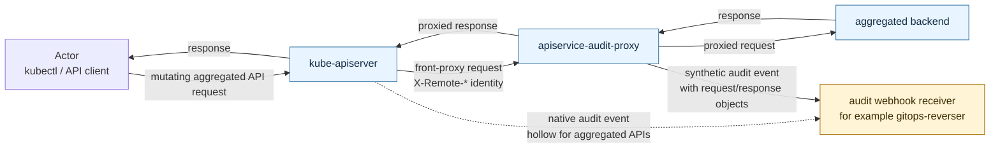

# apiservice-audit-proxy

`apiservice-audit-proxy` is a Go pass-through aggregated API server for
Kubernetes. It sits in front of a real aggregated backend and emits synthetic
`audit.k8s.io/v1` events for mutating requests.

It exists to recover audit fields that kube-apiserver does not populate for
aggregated API requests: `objectRef.name`, `requestObject`, and
`responseObject`. This is the gap `gitops-reverser` needs closed when consuming
audit webhooks for `APIService`-backed APIs.

## How It Fits

In production, the proxy is the registered `APIService` backend from the
kube-apiserver's point of view. It forwards requests to the real aggregated
backend, observes the request and response bodies, and sends enriched audit
events to an audit webhook receiver such as `gitops-reverser`.



In the local demo, the aggregated backend is the Wardle sample-apiserver and the
receiver is webhook-tester. In a `gitops-reverser` deployment, gitops-reverser
is the audit webhook receiver.

The proxy preserves delegated `X-Remote-*` identity, forwards the request to the
real backend, observes the response, and emits one best-effort
`ResponseComplete` audit event. TLS, backend mTLS, requestheader client CA
verification, and webhook delivery are covered in
[Connections and TLS](docs/CONNECTIONS_AND_TLS.md).

## Example Audit Output

The e2e audit-gap test asserts the same contrast shown in these checked-in
payloads. The Lane A and Lane B examples were captured from
`task e2e:test-audit-gap`; the ConfigMap example was captured from the same
cluster to show normal native kube-apiserver audit output for a built-in
resource.

- [Lane A: kube-apiserver native audit](docs/examples/audit-lane-a-kube-apiserver-hollow.json)
  has the collection request, resource, user, and status, but no
  `objectRef.name`, `requestObject`, or `responseObject`.
- [Lane B: apiservice-audit-proxy synthetic audit](docs/examples/audit-lane-b-proxy-complete.json)
  records the same kind of create request with the object name plus request and
  response bodies.
- [Lane A: native built-in ConfigMap audit](docs/examples/audit-lane-a-configmap-complete.json)
  shows the normal kube-apiserver shape for a built-in resource: the native
  audit event includes the name, request body, and response body without help
  from this proxy.

## Development

This repo uses [`task`](https://taskfile.dev) for all common workflows:

```bash
task --list
task fmt
task lint
task test
task build
task helm:lint
task e2e:test-smoke
task e2e:test-audit-gap
```

To open the local webhook-tester UI after an e2e run:

```bash
task e2e:portforward-webhook-tester
```

It reuses an existing healthy forward when possible. Then open:

- proxy audit events: <http://localhost:18090/s/aabbccdd-0000-4000-0000-000000000002>
- kube-apiserver audit events: <http://localhost:18090/s/aabbccdd-0000-4000-0000-000000000001>

Stop it with `task e2e:portforward-stop`.

## Demo Chart

The chart keeps production defaults in `values.yaml`; demo components are
explicit opt-ins:

- `testApiserver.enabled`: deploys the Wardle sample aggregated API backend.
- `webhookTester.enabled`: deploys webhook-tester and generates a proxy webhook
  kubeconfig Secret for demo audit events.

Render the coordinated demo values with:

```bash
helm template apiservice-audit-proxy charts/apiservice-audit-proxy \
  --namespace wardle \
  --values charts/apiservice-audit-proxy/values-demo.yaml
```

Local e2e uses `test/e2e/values/` for the same Helm-managed demo backend and
receiver, plus k3d-specific image and requestheader CA wiring.

## Limits

This is not a full `k8s.io/apiserver` or `kube-aggregator` replacement. It is
focused on mutating aggregated API requests and emits webhook audit events
best-effort: webhook delivery does not fail the proxied API request.

## Docs

- [Architecture](docs/ARCHITECTURE.md)
- [Connections and TLS](docs/CONNECTIONS_AND_TLS.md)
- [Why this exists](docs/WHY.md)
- [E2E setup notes](docs/E2E_SETUP_LESSONS.md)
- [Helm chart values](charts/apiservice-audit-proxy/values.yaml)
