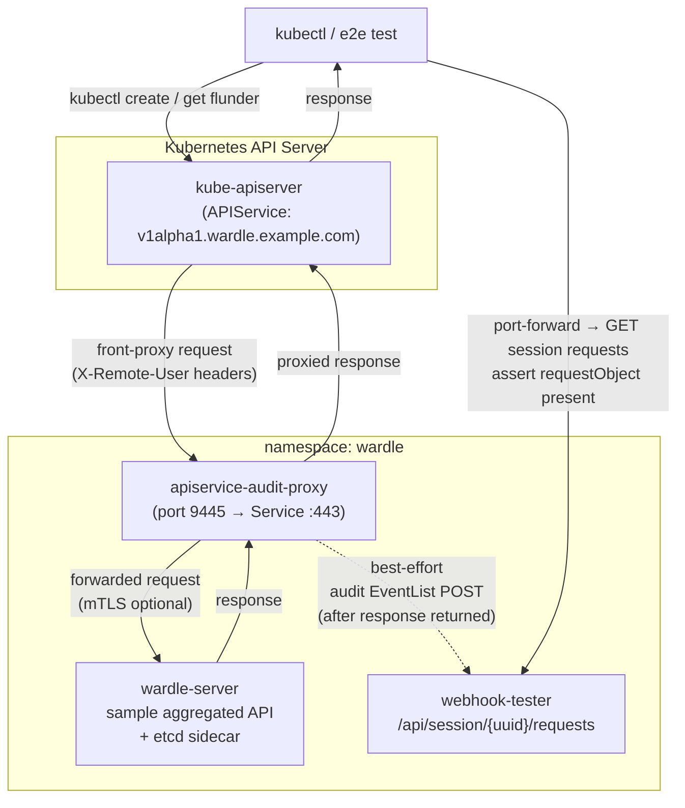

# Architecture

This project is a small pass-through aggregated API server that sits in front
of a real aggregated backend and emits richer synthetic audit events for
mutating requests.

For the upstream rationale behind this approach, see [WHY.md](../WHY.md).

## Purpose

Kubernetes aggregated API requests can produce sparse audit events that are
missing fields GitOps-style consumers need, especially:

- `objectRef.name`
- `requestObject`
- `responseObject`

This proxy restores those fields by observing both sides of the request at the
aggregated backend hop.

## Current Behavior

The proxy:

- stands in front of a real aggregated backend registered through `APIService`
- forwards supported mutating requests to that backend
- captures delegated `X-Remote-*` identity
- captures request and response bodies
- emits one synthetic `audit.k8s.io/v1` `Event` at `stage: ResponseComplete`
- wraps that event in an `EventList`
- POSTs that `EventList` to a kubeconfig-configured audit webhook

## Scope

In scope:

- aggregated API proxying through `APIService`
- mutating verbs: `create`, `update`, `patch`, `delete`
- best-effort webhook delivery after the proxied response completes
- delegated requestheader identity capture
- backend TLS validation and backend mTLS
- optional front-proxy client certificate verification with
  `--client-ca-file`

Out of scope:

- `get`, `list`, and `watch`
- duplicate suppression
- audit-policy-like filtering in the proxy
- durable retry or backpressure management
- full `k8s.io/apiserver` parity
- full kube-aggregator requestheader policy emulation

## Request Flow

1. A client sends a mutating request for an aggregated resource to
   kube-apiserver.
2. kube-apiserver authenticates the caller and forwards the request to this
   proxy through `APIService`.
3. The proxy resolves request metadata and delegated identity.
4. The proxy forwards the request to the real aggregated backend.
5. The backend returns its response.
6. The proxy captures response status and response body.
7. The proxy builds one synthetic `audit.k8s.io/v1` `Event`.
8. The proxy wraps that event in an `EventList`.
9. The proxy POSTs the `EventList` to the configured audit webhook.
10. The proxied backend response is returned to kube-apiserver.

## Identity And Trust Model

The canonical actor identity surface is the delegated requestheader path:

- `X-Remote-User`
- `X-Remote-Uid`
- `X-Remote-Group`
- `X-Remote-Extra-*`

Current trust model:

- if `--client-ca-file` is not configured, the proxy reads delegated identity
  headers without extra certificate verification
- if `--client-ca-file` is configured, the proxy only trusts delegated identity
  when the inbound front-proxy client certificate validates against that CA
  bundle

Current limitation:

- the project does not yet model every upstream requestheader policy knob, such
  as allowed client names

Identity contract:

- preserving the effective delegated user is the primary goal
- exact upstream-style `impersonatedUser` fidelity is not guaranteed

## Audit Event Model

The proxy emits:

- `audit.k8s.io/v1`
- `EventList` payloads
- one `ResponseComplete` event per supported mutating request

Important fields the project aims to recover reliably:

- `user`
- `verb`
- `requestURI`
- `objectRef`
- `requestObject`
- `responseObject`
- `responseStatus`
- request and completion timestamps

## Delivery Model

Webhook delivery is intentionally best-effort:

- audit delivery happens after the proxied request completes
- delivery failures do not fail the proxied API request
- failures are logged
- there is no durable retry queue

## TLS Boundaries

There are three independent trust relationships:

1. kube-apiserver to this proxy
   - serving TLS on the proxy
   - `APIService` trust through CA bundle or dev-only skip-verify mode
2. this proxy to the real aggregated backend
   - backend server validation through `--backend-ca-file` or
     `--backend-insecure-skip-verify`
   - optional backend client certificate authentication
3. this proxy to the audit webhook
   - kubeconfig-driven client and server trust

## Main Packages

- `cmd/server`: server bootstrap and flag handling
- `pkg/proxy`: reverse proxy and audited request handling
- `pkg/audit`: audit event construction
- `pkg/identity`: delegated requestheader identity extraction
- `pkg/webhook`: outbound audit webhook client

## Component Diagram

The diagram below shows the four key components and how they connect during the
local e2e smoke test. Solid arrows are synchronous calls; the dashed arrow is
the best-effort audit webhook POST that happens after the proxied response has
already been returned.

## Local E2E Shape

The local smoke flow is centered on a narrow but realistic path:

- k3d cluster with 1 server + 3 agents
- Flux bootstrap (cert-manager, traefik, reflector, prometheus-operator)
- cert-manager-backed proxy serving TLS
- Wardle sample-apiserver backend
- webhook-tester audit receiver
- one smoke lane using backend skip-verify
- one smoke lane using explicit backend CA validation
