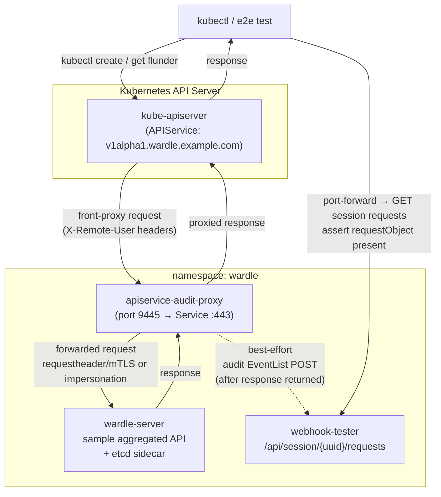

# Architecture

This project is a small pass-through aggregated API server that sits in front
of a real aggregated backend and emits richer synthetic audit events for
mutating requests.

For the upstream rationale behind this approach, see [WHY.md](../WHY.md).

## Purpose

Kubernetes aggregated API requests can produce sparse audit events that are
missing fields GitOps-style consumers need, especially:

- `objectRef.name`
- `requestObject`
- `responseObject`

This proxy restores those fields by observing both sides of the request at the
aggregated backend hop.

## Current Behavior

The proxy:

- stands in front of a real aggregated backend registered through `APIService`
- forwards supported mutating requests to that backend
- captures delegated `X-Remote-*` identity
- forwards backend identity either as requestheader headers or as Kubernetes
  impersonation headers
- captures request and response bodies
- emits one synthetic `audit.k8s.io/v1` `Event` at `stage: ResponseComplete`
- wraps that event in an `EventList`
- POSTs that `EventList` to a kubeconfig-configured audit webhook

## Scope

In scope:

- aggregated API proxying through `APIService`
- mutating verbs: `create`, `update`, `patch`, `delete`
- best-effort webhook delivery after the proxied response completes
- delegated requestheader identity capture
- backend identity modes: `requestheader` and `impersonation`
- backend TLS validation and backend mTLS
- mandatory front-proxy client certificate verification, with trust sourced
  from the `extension-apiserver-authentication` ConfigMap

Out of scope:

- `get`, `list`, and `watch`
- duplicate suppression
- audit-policy-like filtering in the proxy
- durable retry or backpressure management
- full `k8s.io/apiserver` parity
- full kube-aggregator requestheader policy emulation

## Design Decision: An Interceptor, Not An API Server

Registered through an `APIService`, this proxy *is* an aggregated API server in
Kubernetes' eyes — the same category as the backend it fronts. It is, however,
a deliberately **degenerate** one: it serves no API of its own, owns no
resources, and stores nothing. It is an interceptor on the aggregation hop, not
an executor. That nature drives two conscious choices.

### Built as a reverse proxy, not on `genericapiserver`

A backend such as `cozystack-api` or `sample-apiserver` is built on
`k8s.io/apiserver`'s `genericapiserver` / `RecommendedOptions` machinery
because it implements an API: it needs discovery, OpenAPI, admission, REST
storage, and a handler chain that ends in a resource handler.

This proxy needs none of that — it forwards bytes. Building it on
`genericapiserver` would mean using a small fraction of the framework and
suppressing the rest, and the default handler chain unconditionally includes
`WithImpersonation` and `WithAuthorization`, both of which are wrong for a
transparent forwarder (see below). Stripping them requires a custom
`BuildHandlerChainFunc`, at which point the chain is hand-rolled anyway.

So the proxy is a plain `http.Server` plus `httputil.ReverseProxy`. From the
standard `k8s.io/apiserver` packages it adopts only the piece that genuinely
applies: the `headerrequest` authenticator for inbound requestheader trust. Its
planned evolution toward cluster-sourced trust configuration is covered in
[requestheader-trust-design.md](requestheader-trust-design.md).

### Inbound contract is requestheader only — by design

The proxy's one legitimate caller is the front kube-apiserver, which reaches it
through the `APIService` aggregation hop and presents delegated `X-Remote-*`
identity. The proxy deliberately does **not**:

- process inbound `Impersonate-*` headers — they are stripped, never honored;
- accept direct bearer-token callers as an authentication path.

This is not a missing feature. A backend like `cozystack-api` accepts bearer
tokens and processes impersonation because it is the *executor* — direct
clients, controllers, and health probes authenticate to it. This proxy sits
*inside* the aggregation path; copying that permissiveness would:

- be **redundant** — the backend already runs `WithImpersonation`, so a
  proxy-side impersonation check only repeats the same `SubjectAccessReview`;
- make the proxy an **authorizer**, which it deliberately is not — see
  [background-authz.md](background-authz.md) section C;
- open a **direct-access path** that bypasses the front kube-apiserver's own
  authentication and authorization, granting no capability a caller does not
  already have by calling the backend directly.

A component that wants to act as itself with impersonation can call the backend
directly — that is ordinary Kubernetes impersonation and needs no proxy. This
proxy's value is auditing the aggregation hop, and it delivers that without
becoming a general-purpose identity endpoint.

## Request Flow

1. A client sends a mutating request for an aggregated resource to
   kube-apiserver.
2. kube-apiserver authenticates the caller and forwards the request to this
   proxy through `APIService`.
3. The proxy resolves request metadata and delegated identity.
4. The proxy forwards the request to the real aggregated backend.
5. The backend returns its response.
6. The proxy captures response status and response body.
7. The proxy builds one synthetic `audit.k8s.io/v1` `Event`.
8. The proxy wraps that event in an `EventList`.
9. The proxy POSTs the `EventList` to the configured audit webhook.
10. The proxied backend response is returned to kube-apiserver.

## Identity And Trust Model

The canonical actor identity surface at the proxy boundary is the delegated
requestheader path. The exact header names are whatever the cluster publishes
in `kube-system/extension-apiserver-authentication`; in practice:

- `X-Remote-User`
- `X-Remote-Uid`
- `X-Remote-Group`
- `X-Remote-Extra-*`

Inbound trust model:

- The proxy sources its requestheader trust — the front-proxy CA bundle, the
  allowed client common names, and the identity header names — live from the
  cluster's `kube-system/extension-apiserver-authentication` ConfigMap, the
  same configuration kube-apiserver publishes for every aggregated API server.
  See [requestheader-trust-design.md](requestheader-trust-design.md).
- Delegated `X-Remote-*` identity is trusted only when the inbound front-proxy
  client certificate validates against that CA bundle and, where the cluster
  pins them, carries an allowed common name. There is no unverified path: the
  proxy fails startup if the trust configuration cannot be read.
- Trust is dynamic — when the cluster rotates the aggregator CA, the proxy
  adopts the new bundle without a restart.

Outbound identity model:

- `requestheader` mode forwards the verified `X-Remote-*` identity to the
  backend, stripping any `Impersonate-*` and `Authorization` headers a caller
  may have supplied.
- `impersonation` mode strips the inbound identity and authorization surface,
  then calls the backend with the proxy ServiceAccount bearer token plus
  proxy-controlled `Impersonate-*` headers.

Current limitation:

- impersonation mode currently rejects backend client certificate flags; use
  ServiceAccount bearer-token auth plus impersonation RBAC for that mode

Identity contract:

- preserving the effective delegated user is the primary goal
- exact upstream-style `impersonatedUser` fidelity is not guaranteed

## Audit Event Model

The proxy emits:

- `audit.k8s.io/v1`
- `EventList` payloads
- one `ResponseComplete` event per supported mutating request

Important fields the project aims to recover reliably:

- `user`
- `verb`
- `requestURI`
- `objectRef`
- `requestObject`
- `responseObject`
- `responseStatus`
- request and completion timestamps

## Delivery Model

Webhook delivery is intentionally best-effort:

- audit delivery happens after the proxied request completes
- delivery failures do not fail the proxied API request
- failures are logged
- there is no durable retry queue

## TLS Boundaries

There are three independent trust relationships:

1. kube-apiserver to this proxy
   - serving TLS on the proxy
   - `APIService` trust through CA bundle or dev-only skip-verify mode
   - the inbound front-proxy client certificate, verified against the
     cluster-sourced requestheader CA before delegated identity is trusted
2. this proxy to the real aggregated backend
   - backend server validation through `--backend-ca-file` or
     `--backend-insecure-skip-verify`
   - optional backend client certificate authentication
3. this proxy to the audit webhook
   - kubeconfig-driven client and server trust

## Main Packages

- `cmd/server`: server bootstrap and flag handling
- `pkg/proxy`: reverse proxy and audited request handling
- `pkg/audit`: audit event construction
- `pkg/identity`: delegated requestheader identity extraction
- `pkg/webhook`: outbound audit webhook client

## Component Diagram

The diagram below shows the four key components and how they connect during the
local e2e smoke test. Solid arrows are synchronous calls; the dashed arrow is
the best-effort audit webhook POST that happens after the proxied response has
already been returned.

```mermaid
flowchart TD
    client["kubectl / e2e test"]

    subgraph kube["Kubernetes API Server"]
        apiserver["kube-apiserver\n(APIService: v1alpha1.wardle.example.com)"]
    end

    subgraph wardle["namespace: wardle"]
        proxy["apiservice-audit-proxy\n(port 9445 → Service :443)"]
        backend["wardle-server\nsample aggregated API\n+ etcd sidecar"]
        webhook["webhook-tester\n/api/session/{uuid}/requests"]
    end

    client -->|"kubectl create / get flunder"| apiserver
    apiserver -->|"front-proxy request\n(X-Remote-User headers)"| proxy
    proxy -->|"forwarded request\nrequestheader/mTLS or impersonation"| backend
    backend -->|"response"| proxy
    proxy -.->|"best-effort\naudit EventList POST\n(after response returned)"| webhook
    proxy -->|"proxied response"| apiserver
    apiserver -->|"response"| client

    client -->|"port-forward → GET session requests\nassert requestObject present"| webhook
```

## Local E2E Shape

The local smoke flow is centered on a narrow but realistic path:

- k3d cluster with 1 server + 3 agents
- Flux bootstrap (cert-manager, traefik, reflector, prometheus-operator)
- cert-manager-backed proxy serving TLS
- Wardle sample-apiserver backend
- webhook-tester audit receiver
- one smoke lane using backend skip-verify
- one smoke lane using explicit backend CA validation
