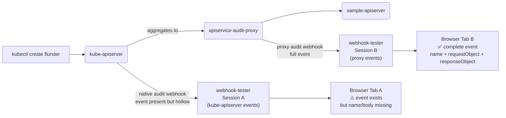
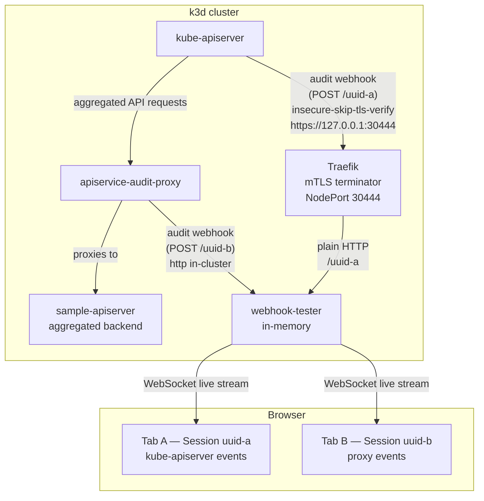

# Plan: Unify on upstream `webhook-tester`, retire `mock-audit-webhook`

## Decision

**We will use [tarampampam/webhook-tester](https://github.com/tarampampam/webhook-tester)
as the single audit-webhook receiver — for both e2e tests and the demo —
and remove the in-repo `mock-audit-webhook` binary.**

The "step-by-step toward this" lives at the bottom of this document.

---

## History (short version)

1. The project shipped with a small in-repo `mock-audit-webhook` binary
   (`cmd/mock-audit-webhook`, ~200 LOC) used by e2e tests as the audit
   receiver and intended to be the demo viewer (with an SSE/HTML UI in a
   future Phase 2 — see [WORK-demo-stack.md](WORK-demo-stack.md)).
2. We then integrated upstream `webhook-tester` into the Helm chart as an
   *optional* demo receiver (`webhookTester.enabled=true`) so the audit-gap
   demo could be shown in a browser without building anything.
3. While doing that, we baked the kube-apiserver's native audit webhook into
   the local k3d cluster too — so a single webhook-tester deployment serves
   both lanes (kube-apiserver native + this proxy) and the gap is visible
   side-by-side in two browser tabs.
4. e2e then grew a `TestAggregatedAPIAuditGap` that asserts on the contrast
   directly. `TestSmoke` was rewritten to query webhook-tester instead of
   `mock-audit-webhook` (commit
   [`18462dc`](https://github.com/ConfigButler/apiservice-audit-proxy/commit/18462dc)).
5. After fixing the deploy/Helm-restart bugs that fell out of step 4
   (see [docs/STATUS.md](STATUS.md)), every e2e path that exercises an audit
   webhook now goes through webhook-tester. The in-repo `mock-audit-webhook`
   is no longer reached by any test, and its planned SSE/HTML viewer is
   superseded by webhook-tester's UI.

This plan formalises that direction and removes the dead weight.

---

## Why webhook-tester wins (and what we give up)

| | webhook-tester (upstream) | `mock-audit-webhook` (in-repo) |
|---|---|---|
| Maintenance | external, upstream issues + bugfixes | ours |
| Browser UI | live, with WebSocket updates | none (the planned SSE/HTML UI was never built) |
| Multiple sessions per deployment | yes (UUID per session — Lane A and Lane B in one pod) | no |
| Container image | public (`ghcr.io/tarampampam/webhook-tester`) | we build + (optionally) publish ours |
| Kubernetes-audit-aware view | no — generic JSON | could have been — but we never built it |
| Build / Dockerfile complexity | none | a `BINARY` build-arg in the Dockerfile multiplexes between two binaries |

**Trade-off accepted**: we lose the *option* of a Kubernetes-audit-aware UI.
The raw JSON view in webhook-tester is sufficient for the gap demo, and if a
schema-aware UI ever becomes worth building, it would deserve its own repo
(see "Future" at the bottom of this document) rather than living inside
the proxy.

---

## The "Why" in one picture

The kube-apiserver **does** emit an audit event for aggregated API requests —
but it is hollow (no `name`, no `requestObject`, no `responseObject`) because
the request is proxied opaquely. The proxy fills the gap by observing both
sides of the conversation. Two tabs, one obvious contrast.

The audit policy at [test/e2e/cluster/audit/policy.yaml](../test/e2e/cluster/audit/policy.yaml)
deliberately does **not** suppress `wardle.example.com` — that hollow event
is the point of the demo, and hiding it would hide the value proposition.

---

## Architecture

Both lanes hit the same webhook-tester deployment in the cluster. Fixed UUIDs
keep the browser URLs and the kube-apiserver audit webhook config stable
across cluster recreations.

---

## What is already in place

These are done — referenced for context in the step-by-step below.

- Helm chart wires `webhookTester.enabled=true` to deploy webhook-tester
  (in-memory, `--auto-create-sessions`) and to **auto-generate** the Secret
  named by `webhook.kubeconfigSecretName` pointing at Lane B
  ([charts/.../webhook-tester-*.yaml](../charts/apiservice-audit-proxy/templates/),
  [values.yaml](../charts/apiservice-audit-proxy/values.yaml)).
- Helm `NOTES.txt` shows both Lane A and Lane B URLs side-by-side
  ([NOTES.txt](../charts/apiservice-audit-proxy/templates/NOTES.txt)).
- `start-cluster.sh` mounts `test/e2e/cluster/audit/` into the k3d server
  node and passes the `--kube-apiserver-arg=audit-*` flags at creation time,
  conditionally and with Docker-outside-of-Docker support
  ([test/e2e/cluster/start-cluster.sh](../test/e2e/cluster/start-cluster.sh)).
- Traefik exposes its `websecure` entrypoint on a fixed `nodePort: 30444`
  so the kube-apiserver can reach Lane A via `https://127.0.0.1:30444`
  ([test/e2e/setup/flux/releases/ingress.yaml](../test/e2e/setup/flux/releases/ingress.yaml)).
- `TestAggregatedAPIAuditGap` asserts the contrast directly
  ([test/e2e/audit_gap_test.go](../test/e2e/audit_gap_test.go)).
- `TestSmoke` queries webhook-tester via the same shared helpers
  ([test/e2e/smoke_test.go](../test/e2e/smoke_test.go),
  [test/e2e/webhook_tester_test.go](../test/e2e/webhook_tester_test.go)).
- Deployment template has a `checksum/webhook-kubeconfig` annotation so a
  Secret-content change triggers a rolling restart of the proxy
  ([charts/.../deployment.yaml](../charts/apiservice-audit-proxy/templates/deployment.yaml)).

---

## Step-by-step: retire `mock-audit-webhook`

Each step is independently mergeable. Numbering is the recommended order — it
keeps `task e2e:test-smoke` green at every checkpoint.

### Step 1 — Remove the unused Taskfile + script + manifests

Nothing in the test suite calls these any more (verified by running
`task e2e:test-smoke` and `task e2e:test-audit-gap` after the e2e:test-smoke
fix landed). Safe to delete in one PR.

- [ ] Delete tasks from [Taskfile.e2e.yml](../Taskfile.e2e.yml):
  `e2e:build-mock-webhook-image`, `e2e:load-mock-webhook-image`,
  `e2e:deploy-mock-webhook`, `e2e:prepare-webhook-kubeconfig`,
  `e2e:build-images`, `e2e:load-images`, `e2e:prepare`, `e2e:prepare-backend-ca`.
- [ ] Delete vars: `E2E_WEBHOOK_IMAGE`, `E2E_WEBHOOK_NAMESPACE`,
  `E2E_WEBHOOK_SERVICE_NAME`.
- [ ] Delete [hack/e2e/write-webhook-kubeconfig.sh](../hack/e2e/write-webhook-kubeconfig.sh).
- [ ] Delete [test/e2e/setup/manifests/mock-audit-webhook/](../test/e2e/setup/manifests/mock-audit-webhook/).
- [ ] Drop `mock-webhook-update` resource from [Tiltfile](../Tiltfile).
- [ ] Re-run: `task e2e:test-smoke && task e2e:test-image-refresh && task e2e:test-audit-gap`.

**Verify**: `grep -rn 'mock-audit-webhook\|MOCK_WEBHOOK\|E2E_WEBHOOK_'` finds
only Go sources, the Dockerfile, and historical docs.

### Step 2 — Delete the binary

- [ ] `rm -rf cmd/mock-audit-webhook/`.
- [ ] Drop `BINARY` build-arg from [Dockerfile](../Dockerfile); hardcode the
  build target to `./cmd/server` and the entrypoint to
  `/apiservice-audit-proxy`. (The artifact name `apiservice-audit-proxy`
  is already the only one this image is published as.)
- [ ] Re-run: `task lint && task test && task helm:lint && task e2e:test-smoke`.

**Verify**: `docker build .` produces an image whose `ENTRYPOINT` is
`/apiservice-audit-proxy` and there is no `--build-arg BINARY=` anywhere.

### Step 3 — Clean up docs

- [ ] In [docs/ARCHITECTURE.md](ARCHITECTURE.md), [docs/ascii-art-diagram.md](ascii-art-diagram.md),
  and [AGENTS.md](../AGENTS.md): replace `mock-audit-webhook` references with
  `webhook-tester` (or remove the section if it described the old layout).
- [ ] Delete [docs/WORK-demo-stack.md](WORK-demo-stack.md) — it is fully
  superseded:
  - "Phase 1b mockAuditWebhook Helm sub-deployment" is moot (the binary is gone).
  - "Phase 2 SSE + embedded HTML UI" was the case for *not* using
    webhook-tester; we picked webhook-tester instead.
  - "Phase 3 separate-repo decision" was contingent on Phase 2 shipping; n/a now.
  - The only piece worth preserving — "testApiserver as optional Helm
    sub-deployment (Phase 1a)" — should move into a new tiny WORK plan if
    we still want it. (It is still wishlist; see [docs/STATUS.md](STATUS.md).)
- [ ] In [docs/STATUS.md](STATUS.md): mark Step 1–3 done, drop W1.
- [ ] Update [README.md](../README.md) so the demo path is `helm install ...
  --set webhookTester.enabled=true`, not the old kustomize+mock flow.

### Step 4 — Make `webhookTester.enabled=true` the default e2e path

The Tiltfile's main `e2e-prepare` resource and the new default for
`task e2e:prepare-…` should deploy with webhook-tester on. After Steps 1–2,
`task e2e:test-smoke` already does this; this step is just bringing the
human-facing dev workflow in line.

- [ ] Either (a) reintroduce a slim `e2e:prepare` that calls `e2e:load-image`
  + `e2e:deploy-with-webhook-tester`, or (b) update the Tiltfile to call
  those two directly. Pick one consistently.
- [ ] Document in [README.md](../README.md): "to bring up the demo locally,
  run `task e2e:cluster-up && task e2e:test-audit-gap`".

### Step 5 — CI

The current [.github/workflows/ci.yml](../.github/workflows/ci.yml) already
publishes only the proxy image. Once Step 2 lands, the `BINARY` arg is gone
and there is nothing to do here. Worth a sanity-check pass:

- [ ] Confirm `e2e-smoke` job still passes against the simplified flow.
- [ ] Confirm no `mock-webhook` image is referenced in CI cache scopes or
  publish steps.

### Step 6 — Release notes

- [ ] Conventional-commit `feat!:` or `refactor!:` prefix to surface the
  removal of the binary in the next release-please PR. Body should call out
  that anyone consuming `ghcr.io/configbutler/apiservice-audit-proxy` is
  unaffected; only consumers building a custom image with
  `--build-arg BINARY=mock-audit-webhook` need to migrate (which is
  effectively zero people — it was never published).

---

## Future (out of scope for this plan)

- **Schema-aware audit viewer**: if a Kubernetes-audit-aware UI ever becomes
  worth building, it should be a separate repo (e.g. `audit-event-viewer`)
  consuming webhook-tester's API or running as its own receiver. This was
  the WORK-demo-stack Phase 3 question; the answer is now "yes, but not
  yet, and not here."
- **`testApiserver` as optional Helm sub-deployment**: still a real wishlist
  item — would let `helm install --set testApiserver.enabled=true
  --set webhookTester.enabled=true` produce a complete demo from the chart
  alone. Captured in [docs/STATUS.md](STATUS.md#wishlist-with-concrete-how-to).
