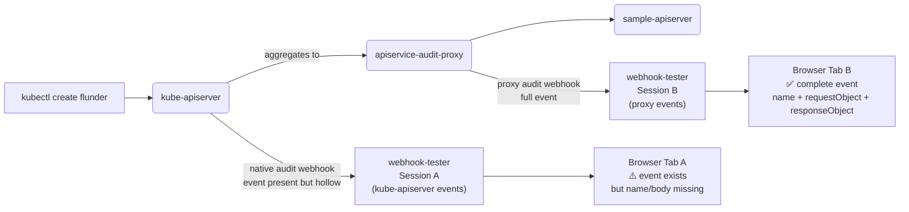
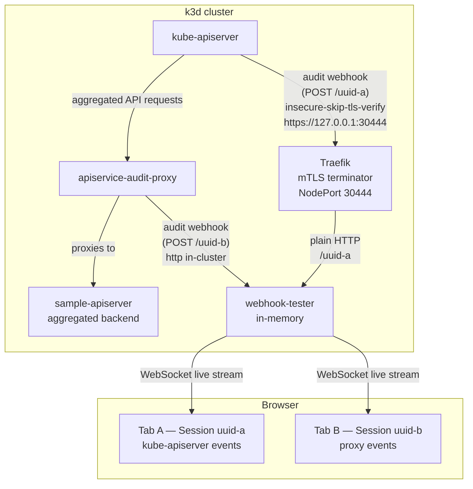

# Unified Audit Demo with webhook-tester

## Goal

Replace the custom `mock-audit-webhook` binary with the upstream
[tarampampam/webhook-tester](https://github.com/tarampampam/webhook-tester) as the single audit event receiver in the
demo stack. This achieves two things at once:

1. **Side-by-side comparison**: the kube-apiserver's native audit webhook and the proxy's outbound audit webhook both
   land in the same webhook-tester deployment, in separate sessions — one browser tab per lane, so the gap the proxy
   fills is immediately visible.
2. **Repo simplification** (stretch goal): if webhook-tester's API is sufficient for e2e test assertions,
   `mock-audit-webhook` can eventually be retired.

A cloned copy of webhook-tester lives at `external-resources/webhook-tester` for API investigation.

> **Scope for this demo**: in-memory storage only. No Redis, no persistence. This is a small investigation setup.
> In production, the audit event stream would be consumed directly by something like `gitops-reverser`.

---

## Implementation Status

| Phase | Status | Notes |
|---|---|---|
| 1. webhook-tester in Helm chart | ✅ Done | Deployed and validated end-to-end |
| 2. kube-apiserver audit in e2e cluster (always on) | ✅ Done | Validated: Lane A silent, Lane B captures |
| 3. mock-audit-webhook retirement | ⏳ Future | Not started — blocked on Phase 1 & 2 validation |

---

## The "Why" in One Picture



The kube-apiserver **does** emit an audit event for aggregated API requests — but it is hollow. Because the
request is proxied opaquely, the kube-apiserver cannot decode what happened inside the aggregated API server.
The event arrives with `verb`, `resource`, and `responseStatus`, but `name`, `requestObject`, and
`responseObject` are all missing. It is not a failure — it is a silent gap.

Tab B lights up with the complete picture because the proxy intercepts the request, observes both sides of the
conversation, and re-emits a fully populated `audit.k8s.io/v1` event. That contrast — one tab with a hollow
event, one tab with everything — is the value proposition of this tool, shown in five seconds without any
explanation.

---

## Architecture

### Component Map



### Traffic Lanes

**Lane A — kube-apiserver native audit**

```
kube-apiserver
  → audit policy: capture RequestResponse for write verbs (wardle.example.com included)
  → webhook-config: server: https://127.0.0.1:30444/aabbccdd-0000-4000-0000-000000000001
                    insecure-skip-tls-verify: true
  → Traefik (NodePort 30444, TLS termination)
  → webhook-tester POST /aabbccdd-...-000000000001
  → stored in Session A
  → event present: verb ✓  resource ✓  status ✓
                   name ✗  requestObject ✗  responseObject ✗
```

**Lane B — proxy audit**

```
kubectl create flunder.wardle.example.com
  → kube-apiserver (aggregated, transparent)
  → apiservice-audit-proxy
    → proxies to sample-apiserver
    → intercepts request/response
    → builds audit.k8s.io/v1 EventList
  → webhook kubeconfig (auto-generated by Helm):
      server: http://<wt-svc>.wardle.svc.cluster.local:8080/aabbccdd-0000-4000-0000-000000000002
  → webhook-tester POST /aabbccdd-...-000000000002
  → stored in Session B
```

---

## Files Changed

### New files

| File | Purpose |
|---|---|
| `test/e2e/cluster/audit/policy.yaml` | kube-apiserver audit policy. Captures `RequestResponse` for all write verbs, including `wardle.example.com` — so Lane A shows the hollow event the kube-apiserver produces. Filters out high-noise resources (events, leases, status subresources, tokenreviews). |
| `test/e2e/cluster/audit/webhook-config.yaml` | kube-apiserver audit webhook bootstrap config. Points at `https://127.0.0.1:30444/<uuid-a>` with `insecure-skip-tls-verify: true`. |
| `charts/apiservice-audit-proxy/templates/webhook-tester-deployment.yaml` | Helm template for the webhook-tester Deployment. |
| `charts/apiservice-audit-proxy/templates/webhook-tester-service.yaml` | ClusterIP Service for webhook-tester. |
| `charts/apiservice-audit-proxy/templates/webhook-tester-ingress.yaml` | Ingress (class: traefik) for browser access to webhook-tester UI. |
| `charts/apiservice-audit-proxy/templates/webhook-tester-kubeconfig-secret.yaml` | Auto-generates the Secret named by `webhook.kubeconfigSecretName`, pointing the proxy's outbound webhook at webhook-tester Session B. |

### Modified files

| File | Change |
|---|---|
| `charts/apiservice-audit-proxy/values.yaml` | Added `webhookTester` block (disabled by default). Fixed tag: `2.3.0` not `v2.3.0`. Added `kubeApiserverSessionUUID` for NOTES display. |
| `charts/apiservice-audit-proxy/templates/_helpers.tpl` | Added `webhookTester.fullname`, `webhookTester.selectorLabels`, `webhookTester.labels` helpers. |
| `charts/apiservice-audit-proxy/templates/NOTES.txt` | Added conditional block showing both Lane A and Lane B browser URLs with a one-line explanation. |
| `test/e2e/cluster/start-cluster.sh` | Merged Docker-outside-of-Docker path resolution (from gitops-reverser) and audit webhook auto-wiring. When `test/e2e/cluster/audit/` files are present, the cluster is created with `--kube-apiserver-arg` flags and volume mounts. Gracefully skips if files are absent. |
| `test/e2e/setup/flux/releases/ingress.yaml` | Added `ports.websecure.nodePort: 30444` to Traefik Helm values. Gives kube-apiserver a stable NodePort to reach via `127.0.0.1:30444`. |
| `.devcontainer/devcontainer.json` | Added `HOST_PROJECT_PATH: "${localWorkspaceFolder}"`. Required for Docker-outside-of-Docker setups where the Docker daemon's path differs from the container's `/workspaces/...` path. Takes effect after devcontainer rebuild. |

---

## Key Design Decisions

### Fixed UUIDs

Both session UUIDs are fixed well-known values:

- Lane A (kube-apiserver): `aabbccdd-0000-4000-0000-000000000001`
- Lane B (proxy): `aabbccdd-0000-4000-0000-000000000002`

This makes browser URLs predictable across cluster recreations and Helm upgrades. No querying the cluster to
find the URL.

### TLS: kube-apiserver requires HTTPS, proxy does not

The kube-apiserver audit webhook spec only supports `https://` endpoints. The proxy's outbound webhook client
is not constrained this way and uses plain `http://` in-cluster (shorter path, no cert management needed).

For Lane A: Traefik's `websecure` entrypoint on fixed NodePort 30444 terminates TLS. The kube-apiserver uses
`insecure-skip-tls-verify: true` to accept Traefik's default self-signed cert. This is the same pattern proven
in the gitops-reverser project.

For Lane B: direct plain HTTP to the webhook-tester ClusterIP Service. No Traefik hop needed.

### Audit policy: wardle.example.com is NOT suppressed

The audit policy deliberately does **not** add a `level: None` rule for `wardle.example.com`. The kube-apiserver
will attempt to audit these requests at `RequestResponse` level — and it will produce an event. But because the
kube-apiserver proxies the request opaquely, it cannot populate `name`, `requestObject`, or `responseObject`.
The resulting event is structurally present but informationally hollow.

That hollow event is the point of the demo. Suppressing it would hide the problem rather than illustrate it.

### Audit webhook baked into cluster creation

The kube-apiserver audit policy and webhook config are cluster-creation-time arguments. They cannot be injected
after the fact via a Helm chart or `kubectl apply`. The right place for this is `start-cluster.sh`, which now
conditionally mounts `test/e2e/cluster/audit/` into the k3d server node and passes the four `--kube-apiserver-arg`
flags at creation time.

The conditional (`audit_files_present`) means the cluster script degrades gracefully: if the audit files are not
present (e.g., someone clones the repo without them), the cluster starts without audit webhook support rather than
failing.

### `HOST_PROJECT_PATH` for Docker-outside-of-Docker

k3d volume mounts require a path visible to the Docker daemon. In a devcontainer using Docker-outside-of-Docker,
the daemon sees the host filesystem (e.g., `/home/user/git/repo`), not the container's `/workspaces/...` path.
The `start-cluster.sh` script calls `resolve_host_project_path`, which probes both `$(pwd -P)` and
`$HOST_PROJECT_PATH` via a test Docker run to find which path the daemon can actually mount.

The devcontainer now sets `HOST_PROJECT_PATH: "${localWorkspaceFolder}"` which resolves to the host-side
workspace path at container build time. This requires a devcontainer rebuild to take effect.

### webhook-tester image tag

The public image is `ghcr.io/tarampampam/webhook-tester:2.3.0` — no `v` prefix. The `:2` floating tag resolves
to the same digest and can be used if pinning to a minor release isn't required.

---

## Helm Usage

### Enable webhook-tester in the demo stack

```bash
helm upgrade --install apiservice-audit-proxy ./charts/apiservice-audit-proxy \
  --namespace wardle \
  --create-namespace \
  --values test/e2e/values/proxy-cert-manager.yaml \
  --set image.repository=apiservice-audit-proxy \
  --set image.tag=e2e-local \
  --set webhookTester.enabled=true
```

When `webhookTester.enabled=true`, the chart:

1. Deploys webhook-tester (in-memory, `--auto-create-sessions`, port 8080).
2. Creates an Ingress (class: traefik) for browser access.
3. **Auto-generates** the Secret named by `webhook.kubeconfigSecretName` pointing at Lane B. No manual
   `task e2e:prepare-webhook-kubeconfig` step needed.

### Access the UI

After deploying:

```bash
kubectl port-forward -n wardle svc/apiservice-audit-proxy-webhook-tester 8080:8080
```

Then open two tabs:

| Tab | URL | Expected |
|---|---|---|
| Lane A | `http://localhost:8080/aabbccdd-0000-4000-0000-000000000001` | Event present but `name`, `requestObject`, `responseObject` all missing — the hollow record kube-apiserver produces |
| Lane B | `http://localhost:8080/aabbccdd-0000-4000-0000-000000000002` | Full event with name, request body, and response body — what the proxy adds |

---

## Validation Results

Validated on a fresh k3d cluster (`task e2e:cluster-up` equivalent with `HOST_PROJECT_PATH` set).

### kube-apiserver audit flags confirmed

```
$ docker exec k3d-audit-pass-through-e2e-server-0 ps aux | grep -o 'audit[^ ]*'
audit-policy-file=/etc/kubernetes/audit/policy.yaml
audit-webhook-batch-max-size=10
audit-webhook-batch-max-wait=1s
audit-webhook-config-file=/etc/kubernetes/audit/webhook-config.yaml
```

### The side-by-side contrast

After `kubectl apply` of a `Flunder` (wardle.example.com write):

```
Lane A — kube-apiserver native audit  [1 batch, 1 event]
  verb=create  resource=flunders  name=None  status=201
    requestObject:  *** MISSING ***
    responseObject: *** MISSING ***

Lane B — apiservice-audit-proxy  [1 batch, 1 event]
  verb=create  resource=flunders  name=demo-contrast  status=201
    requestObject:  present (384 chars)
    responseObject: present (818 chars)
```

**Lane A is not silent — it is hollow.** The kube-apiserver sees the HTTP transaction and produces an audit
event, but because it proxies the request opaquely it cannot populate `name`, `requestObject`, or
`responseObject`. The event exists but carries no actionable information about what the user actually created.

**Lane B is complete.** The proxy intercepts both sides of the conversation and emits a fully populated event.

This is the gap. It is not a kube-apiserver bug — it is a structural limitation of how aggregated API servers
work. The audit trail for those resources can only be complete if something at the proxy boundary observes and
records the interaction.

### Traefik → webhook-tester (Lane A path) confirmed live

Lane A received multiple batches of regular Kubernetes write events (services, configmaps, etc.) throughout the
test run — confirming the full `kube-apiserver → Traefik NodePort 30444 → webhook-tester` path is operational.

### webhook-tester startup log

```json
{"level":"info","msg":"HTTP server starting","address":"0.0.0.0","port":8080,"storage":"memory","pubsub":"memory"}
```

Clean startup, no errors.

### kube-apiserver logs

No audit webhook errors. The `--audit-webhook-batch-max-wait=1s` setting ensures events arrive within one second
of the request completing, which is acceptable for a demo setup.

---

## How webhook-tester Routes Incoming Webhooks

From `internal/http/middleware/webhook/middleware.go` in the cloned source at
`external-resources/webhook-tester/`:

```go
func shouldCaptureRequest(r *http.Request) (string, bool) {
    clean := strings.TrimLeft(r.URL.Path, "/")
    if len(clean) >= openapi.UUIDLength && openapi.IsValidUUID(clean[:openapi.UUIDLength]) {
        return clean[:openapi.UUIDLength], true
    }
    return "", false
}
```

Any request whose path starts with a valid UUID is captured into that session. The rest of the path is ignored.
`--auto-create-sessions` means a POST to a non-existent UUID creates the session on the spot with a 200 default
response. No init job, no pre-call, no ordering dependency.

---

## webhook-tester API Assessment

Source: `external-resources/webhook-tester/api/openapi.yml`

| Capability | Available | Notes |
|---|---|---|
| Receive any POST body | ✅ | Any content-type, any path under `/<uuid>` |
| In-memory storage | ✅ | Default driver, no external dependency |
| List captured requests | ✅ | `GET /api/session/<uuid>/requests` |
| Get single request | ✅ | `GET /api/session/<uuid>/requests/<req-uuid>` |
| Delete session / requests | ✅ | `DELETE /api/session/<uuid>` |
| Live browser UI | ✅ | Served at `/` |
| WebSocket live updates | ✅ | `GET /api/session/<uuid>/requests/subscribe` |
| Auto-create sessions | ✅ | `--auto-create-sessions` flag |
| Kubernetes audit event awareness | ❌ | Raw JSON only, no structured display |
| Configurable response code | ✅ | Set per session; can also be overridden in URL path |
| Health / readiness probes | ✅ | `/healthz`, `/ready` |

Captured bodies are stored as base64 in `request_payload_base64`. The browser UI decodes and pretty-prints
automatically.

---

## e2e Test: TestAggregatedAPIAuditGap

`test/e2e/audit_gap_test.go` is a purpose-built test that asserts the "why" of the proxy. It runs against the
live cluster using both webhook-tester sessions.

```
task e2e:test-audit-gap
```

The test creates a Flunder and then makes two assertions in sequence:

**`LaneB_proxy_event_is_complete`** — the proxy's event must have all three fields:
- `name` matches the created resource
- `requestObject` is present
- `responseObject` is present

**`LaneA_kube_apiserver_event_is_hollow`** — the kube-apiserver's event must be missing all three fields.
These assertions are *inverted*: the test **passes** when the fields are absent, and **fails** with an
explanatory message when they are present.

Sample output from a passing run:

```
=== RUN   TestAggregatedAPIAuditGap/LaneB_proxy_event_is_complete
    Lane B: name="audit-gap-1776961237" requestObject=383 chars responseObject=791 chars
=== RUN   TestAggregatedAPIAuditGap/LaneA_kube_apiserver_event_is_hollow
    Lane A: event found — verb=create resource=flunders status=201 (checking for missing fields...)
    Lane A: name is absent (expected — kube-apiserver cannot resolve it through the proxy)
    Lane A: requestObject is absent (expected — kube-apiserver cannot decode aggregated types)
    Lane A: responseObject is absent (expected — kube-apiserver cannot decode aggregated types)
--- PASS: TestAggregatedAPIAuditGap (7.38s)
```

If a future Kubernetes version closes the gap natively, the `LaneA_kube_apiserver_event_is_hollow` sub-test
will fail with a message explaining what changed and prompting a review of whether the proxy is still needed.
The test is intentionally written so that failure on Lane A is *good news*, not a regression.

---

## Phase 3 — Decision: retire mock-audit-webhook?

**Trigger**: Phases 1 and 2 are working and the demo has been run at least once end-to-end. ✅ Met.

**What to assess:**

- Audit the current e2e assertions against `mock-audit-webhook`.
- Prototype one test case using `GET /api/session/<uuid>/requests` + base64 decode.
- If feasible: migrate all e2e assertions, remove `mock-audit-webhook` binary and Dockerfile target.
- If not feasible (e.g., latency, body size limits, assertion complexity): keep both.

webhook-tester's `GET /api/session/<uuid>/requests` returns a JSON array of captured requests. Each entry has
`request_payload_base64` containing the full `audit.k8s.io/v1 EventList`. Assertions are straightforward:
fetch → decode → `json.Unmarshal` → assert on event fields.

The main difference from `mock-audit-webhook` is that the session model requires knowing the UUID upfront. Since
the UUIDs are fixed constants, this is trivial to wire into test helpers.
